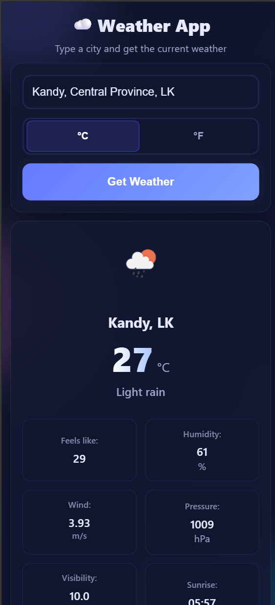

# Weather Application
🌦️ A responsive Weather App built with HTML, CSS, and JavaScript using OpenWeather API.

## Technologies
- **HTML**
- **CSS**
- **JavaScript**
  
## Project Description
Objective: Build a responsive web-based weather application where users can enter a city and instantly see the current weather conditions.  
The app displays:
- Temperature (°C/°F toggle)
- Weather description
- Weather icon
- Extra details (feels like, humidity, wind, pressure, visibility, sunrise, sunset)
- 5-day forecast (midday snapshots with icons)

### Skills to Practice
- **HTML** for structuring the app
- **CSS** for styling, layout, and responsiveness
- **JavaScript** for fetching weather data and interactivity
- **Integration with OpenWeatherMap API**

## Project Requirements
- **User Input:** Text field for entering city name  
- **Submit Button:** Fetch weather on click/Enter  
- **Display Weather Data:** Current weather, details, and forecast  
- **Unit Toggle:** °C ↔ °F  
- **City Suggestions:** Autocomplete using OpenWeather Geo API  
- **Styling:** Modern, animated, and mobile-friendly UI  
- **Error Handling:** Clear messages for invalid input or API issues  
- **API Usage:** [OpenWeatherMap](https://openweathermap.org/) free tier  

## Project Guidelines
1. Start with the HTML structure for inputs and result containers.  
2. Style the app with CSS for a modern, animated, and responsive design.  
3. Use JavaScript (async/await) to call the weather and forecast APIs.  
4. Handle errors gracefully (invalid city, bad API key, network).  
5. Test across devices and screen sizes.  
6. Follow OpenWeatherMap’s terms of service.

## Setup Instructions
1. Clone or unzip the project.  
2. Open `script.js` and replace the placeholder key:
   ```js
   const API_KEY = "YOUR_OPENWEATHERMAP_KEY";
## 📸 UI Previews

Here are some screenshots of the Weather App:

### 🔹 Home Screen


### 🔹 Search


### 🔹 Results


### 🔹 Suggestions


### 🔹 Mobile View


### 🔹 Mobile View Search


### 🔹 Mobile View Results



### 🔹Error Handling


[👉 **Live Preview on GitHub Pages**](https://ruvi7599.github.io/weather-app/)
